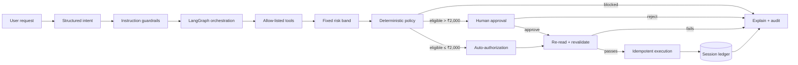

# PayPilot AI

**Agentic Payment Orchestration — public portfolio simulation**

PayPilot AI is built for a **digital-banking / payments user** who wants to create payment destinations and initiate payments through natural language instead of navigating a traditional transfer form. The AI interprets the request and orchestrates narrow tools; deterministic policy and risk code decides what is allowed; eligible payments up to **₹2,000 auto-execute after safety checks**, while larger payments pause for explicit human approval.

> **No real money, bank credentials, cards, UPI credentials or customer data are used.** A fresh browser session also contains **no preloaded account, payees, bills or transaction history**. The user creates the simulation state they want to test.

## What a recruiter sees

A new session starts empty:

- account: not configured
- payment destinations: 0
- bills: 0
- transactions: 0
- agent runs: 0

The recruiter can then:

1. Create **multiple simulated accounts** (Savings / Current / Wallet), choose a primary source, pause/resume accounts, and edit limits/nicknames. The opening balance is set once at account creation; later balance movement happens through payments or atomic account-to-account transfers with paired debit/credit ledger entries.
2. Add payment destinations such as bank transfers, UPI, mobile recharge, merchant payment, subscription, donation or a custom type.
3. Edit/remove payees and create/edit/remove pending bills.
4. Select the source account and ask the AI Assistant to pay one of those **user-created** destinations.
5. Search/filter/export transaction activity and inspect the visible agent trace, policy checks, risk band, approval decision and ledger result.
6. Reset the session back to completely empty state.

Nothing such as a person name, merchant, recharge number, bill or previous transaction is inserted by the runtime beforehand.

## Core behavior

### Authorization threshold

| Payment amount | Behavior |
|---|---|
| `≤ ₹2,000` | Auto-executes after deterministic safety checks and execution-time revalidation |
| `> ₹2,000` | Requires explicit human approval before execution |

A user can still request stricter confirmation with wording such as “ask me if it is above ₹500”; user-requested confirmation can therefore require approval even below ₹2,000.

### Fixed risk bands

| Amount | Risk band | Score used by demo |
|---|---|---|
| `≤ ₹10,000` | LOW | 20/100 |
| `> ₹10,000` and `≤ ₹50,000` | MEDIUM | 60/100 |
| `> ₹50,000` | HIGH | 90/100 |

These are transparent, deterministic portfolio rules — **not a claimed fraud-detection ML model**. The demo transfer limit is ₹1,00,000. Amounts above ₹50,000 enter the HIGH-risk band and require explicit human approval when they remain within the platform, balance, and daily-limit rules. The current fixed HIGH score is 90/100; the configurable hard risk-block threshold is 95 so HIGH is escalated rather than automatically rejected.

## Example journey — with your own names/data

Suppose the recruiter creates a destination named `My Mobile` with type `mobile_recharge` and reference `98XXXXXXXX`, then asks:

```text
Recharge My Mobile for ₹499
```

The agent can resolve that exact user-created destination, read the current balance, assign the LOW risk band, run policy checks, revalidate the latest state and auto-execute because ₹499 is within the ₹2,000 threshold.

If the recruiter creates another destination and asks for ₹12,000, the risk band is MEDIUM and the run pauses at `AWAITING_APPROVAL`. Approval never bypasses safety: balance, daily limit, conditions, destination/bill state and risk are checked again immediately before execution.

## Why this is agentic

This is not a chatbot that returns “payment successful” text. A stateful workflow performs actual controlled steps against the session ledger.



LangGraph provides the stateful workflow and interrupt/resume boundary. Gemini structured output is optional for natural-language intent extraction. Deterministic parsing and safety rules remain authoritative for recognized financial fields, and the project can still be explored without a model key using its deterministic parser.

## Public simulation design

Every browser gets an isolated UUID session. The server scopes all user-created accounts, payment destinations, bills, transactions, payment requests and agent runs to that session. Every side-effecting agent run is also pinned to an explicit source account. **Reset demo** deletes that session's financial state and returns it to empty.

There is intentionally:

- no sign-up or login
- no hidden admin dashboard
- no preloaded business/domain data
- no real payment gateway or bank integration
- no real payment/customer data
- no vector database or RAG
- no unrestricted SQL, shell, browser or arbitrary HTTP tool

Stale sessions expire automatically. Agent runs have per-session and global demo rate limits, and only server-created UUID sessions are accepted by stateful endpoints.

## Stack

| Layer | Technology |
|---|---|
| Frontend | React, Vite, responsive custom CSS |
| API | FastAPI, Pydantic |
| Agent orchestration | LangGraph + SQLite checkpointing with durable-domain recovery |
| Optional GenAI | Gemini structured output |
| Domain persistence | SQLAlchemy + SQLite locally / PostgreSQL for hosted durability |
| Money representation | `Numeric(14,2)` + Python `Decimal` |
| Safety | instruction guardrails, deterministic policy/risk, conditional HITL, execution-time revalidation, idempotency |
| Testing | Pytest + FastAPI TestClient + dependency-runtime checks |
| Deployment | Vercel frontend + Render backend + managed PostgreSQL |

## Core agent tools

`get_balance` (selected source account) · `find_beneficiary` (internal payment-destination model) · `get_bill` · `monthly_spending` · `analyze_transaction_history` · `calculate_risk` · `check_payment_policy` · `execute_payment`

The underlying database model retains the internal name `Beneficiary`, but the public product supports arbitrary **payment destinations** rather than only people. The agent never gets raw database access.

## Safety rules

A financial request is stopped when any hard rule fails, including:

- negated/cancellation wording
- scheduled/recurring or chained payment wording (unsupported by this demo)
- unknown/unconfirmed or ambiguous payment destination
- non-INR payment instruction
- missing/invalid amount
- conflicting bill amount
- insufficient balance
- per-payment simulation limit exceeded
- daily payment limit exceeded
- user's minimum-remaining-balance condition violated
- HIGH fixed risk band / configured risk block threshold

For payments up to ₹2,000, auto-authorization is still followed by a **fresh execution-time revalidation**. For payments above ₹2,000, approval is required and then the same revalidation occurs. The final check/execute boundary is serialized in-process and at the database layer (SQLite `BEGIN IMMEDIATE` or a PostgreSQL row lock), so concurrent workers cannot authorize against the same stale balance/daily-limit snapshot.

## Production-style hardening in this portfolio

- Payment side effects cannot be introduced by LLM-only interpretation; deterministic parsing must recognize the supported financial action and authoritative financial fields.
- Final authorization, ledger mutation, transaction creation and final audit events commit as one database transaction.
- Execution is idempotent, and balance/daily-limit/bill/risk state is re-read under a database-side serialization lock immediately before mutation.
- Browser session IDs are server-generated UUID capabilities. Missing, forged or expired sessions are rejected rather than silently created.
- Public agent traffic is bounded by both per-session and global rate limits.
- Reset/TTL cleanup removes domain state and associated LangGraph checkpoint threads.
- API responses carry request IDs, timing metadata, no-store caching for demo state, and basic browser security headers. User prompts are not written to request logs.
- Docker runs the backend as a non-root user and excludes secrets, databases, virtualenvs, caches and dependency folders from build context/package output.
- `/health` exposes degraded runtime state; `/ready` verifies database connectivity for deployment routing.

> This is still a portfolio simulation, not a real banking system. A real-money deployment would additionally require strong user authentication, authorization, KYC/AML/fraud controls, managed secrets/HSMs, regulated audit retention, distributed rate limiting, database migrations, backups/PITR, and payment-network integrations.

## Run locally

### Option A — Docker Compose

```bash
cp .env.example .env
# GEMINI_API_KEY is optional
docker compose up --build
```

Frontend: `http://localhost:5173`  
API docs: `http://localhost:8000/docs`  
Health: `http://localhost:8000/health`  
Readiness: `http://localhost:8000/ready`

### Option B — backend + frontend separately

Backend:

```bash
cd backend
python -m venv .venv
# Windows PowerShell: .\.venv\Scripts\Activate.ps1
# macOS/Linux: source .venv/bin/activate
pip install -r requirements-dev.txt
uvicorn app.main:app --reload
```

Frontend:

```bash
cd frontend
cp .env.example .env
npm ci
npm run dev
```

`GEMINI_API_KEY` is optional. After installing dependencies, `/health` should report `"agent_runtime": "langgraph"`. If it reports `fallback`, inspect `runtime_fallback_reason` before deployment.

## Tests

```bash
cd backend
pytest -q
```

The suite covers empty-session setup, multiple accounts, account editing/primary selection/pause, ledgered add-money credits, source-account isolation, payee/bill editing, arbitrary payment-destination types, ≤₹2,000 auto-execution, >₹2,000 approval, explicit confirmation overrides, fixed risk boundaries, bill integrity, negation/scheduling/multiple-action guardrails, stale approvals, daily-limit races, Decimal precision, session isolation, reset/TTL cleanup, rate limiting and real dependency initialization.

Test fixtures contain synthetic names solely inside automated tests; they are **not runtime seed data** and never appear in a recruiter's fresh session.

See [VALIDATION.md](VALIDATION.md) for the exact validation performed on this artifact.

## Project structure

```text
paypilot-ai/
├── backend/
│   ├── app/
│   │   ├── agents/       # state graph + conditional HITL runtime
│   │   ├── api/          # FastAPI routes + user-created setup APIs
│   │   ├── database/     # SQLAlchemy setup
│   │   ├── models/       # session ledger + agent audit entities
│   │   ├── schemas/      # Pydantic contracts
│   │   ├── services/     # banking, risk, policy, payment, audit
│   │   └── tools/        # allow-listed agent tools
│   └── tests/
├── frontend/
│   └── src/
├── docs/
│   ├── ARCHITECTURE.md
│   ├── AGENT_WORKFLOW.md
│   ├── DEPLOYMENT.md
│   ├── SECURITY.md
│   └── INTERVIEW_GUIDE.md
├── scripts/
│   ├── smoke_test.py
│   └── package_project.py
├── docker-compose.yml
└── render.yaml
```

## Architecture decisions worth discussing in interviews

1. **AI interprets; deterministic policy authorizes.** The model cannot override payment rules.
2. **Authorization is amount-aware.** ≤₹2,000 can auto-execute; >₹2,000 requires HITL approval; an explicit user confirmation condition can be stricter.
3. **Authorization is not stale authority.** Latest balance, limit, conditions, bill state and risk are revalidated immediately before execution.
4. **Risk is intentionally transparent.** Fixed LOW/MEDIUM/HIGH amount bands are easy to explain and are not misrepresented as ML fraud detection.
5. **Tools are narrow and allow-listed.** No arbitrary code/SQL execution exists.
6. **Execution is idempotent.** Repeated execution cannot create duplicate payments.
7. **Money is fixed-point.** Ledger persistence uses `Decimal`/`Numeric`, not binary float.
8. **The domain is user-created.** No hard-coded person, biller, merchant, recharge target or transaction appears in a fresh session.
9. **Observability is productized.** Agent decisions and tool results are visible in the UI.
10. **Public simulation is isolated by design.** Recruiters can explore the complete workflow without authentication while using only their own session-created state.
11. **Durable state is separate from workflow checkpoints.** Managed PostgreSQL owns hosted domain/payment state; a lost lightweight graph checkpoint cannot bypass revalidation or idempotency.
12. **Retries are first-class.** Duplicate approval/rejection retries return the existing terminal result, while contradictory decisions are rejected.
13. **Multi-account state is explicit.** Every run stores its source account, daily limits are enforced per account, and one account cannot accidentally debit another.
14. **Balance changes are ledgered.** Account metadata is editable, but balance is changed through explicit simulated credit/payment transactions rather than hidden field edits.

## Documentation

- [Architecture](docs/ARCHITECTURE.md)
- [Agent workflow](docs/AGENT_WORKFLOW.md)
- [Security & guardrails](docs/SECURITY.md)
- [Deployment](docs/DEPLOYMENT.md)
- [Interview guide](docs/INTERVIEW_GUIDE.md)

## Disclaimer

PayPilot AI is an educational portfolio simulation. It is **not** a production banking/payment system and must not be connected to real funds or real financial credentials without a complete production security, compliance, transactionality and payment-provider architecture.

## License

MIT
