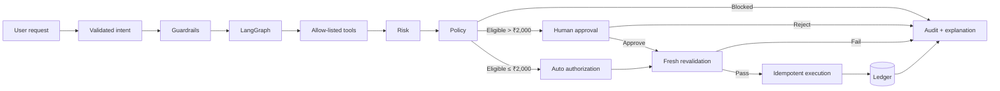

# PayPilot AI

**Agentic Payment Orchestration Sandbox**

PayPilot AI is a public, fake-money banking simulation that demonstrates how an AI agent can understand natural-language payment requests while deterministic backend controls retain financial authority.

Users create their own simulated accounts, payment destinations and bills. The agent can plan and orchestrate payments, evaluate transparent risk rules, request human approval when required, execute eligible payments and expose the complete decision trace.

> No real money, bank credentials, cards, UPI credentials or customer data are used.

---

## Why I built this

Many agent demos stop at:

```text
User prompt → LLM → response
```

PayPilot focuses on the harder engineering problem:

```text
Natural language
        ↓
Structured intent
        ↓
LangGraph orchestration
        ↓
Allow-listed tools
        ↓
Deterministic risk + policy
        ↓
Auto authorization / HITL
        ↓
Fresh state revalidation
        ↓
Idempotent atomic execution
        ↓
Ledger + audit trace
```

The LLM helps interpret and orchestrate.

It does **not** have authority to bypass payment policy or directly mutate balances.

---

## Demo experience

Every new browser session begins empty.

The user creates:

- simulated Savings, Current or Wallet accounts
- payment destinations / payees
- bills
- their own transaction history through the application

There is no runtime-seeded merchant, person, bill or transaction.

### Account rules

- maximum opening balance: **₹2,00,000**
- maximum configurable daily payment limit: **₹2,00,000**
- opening balance is set once during account creation
- balances cannot be manually edited afterward
- accounts can be paused/resumed
- one account can be selected as primary
- payments explicitly retain their source account
- account-to-account transfers create matching DEBIT/CREDIT ledger entries

### Payment rules

| Amount | Risk | Authorization |
|---|---|---|
| ≤ ₹2,000 | LOW | Auto-execute after safety checks |
| ₹2,001 – ₹10,000 | LOW | Human approval |
| ₹10,001 – ₹50,000 | MEDIUM | Human approval |
| ₹50,001 – ₹1,00,000 | HIGH | Human approval |
| > ₹1,00,000 | — | Blocked by demo platform limit |

Risk and approval are deliberately separate.

For example, a ₹5,000 payment is **LOW risk**, but still requires approval because automatic execution stops at ₹2,000.

The transparent demo risk scores are:

```text
LOW     20 / 100
MEDIUM  60 / 100
HIGH    90 / 100
```

The default hard risk-block threshold is `95`, so HIGH requests are escalated rather than automatically rejected when all other policy checks pass.

These rules are intentionally deterministic and are **not presented as an ML fraud model**.

---

## Example workflow

Suppose the user creates:

```text
Account: Salary
Payee: Rahul
Reference: rahul@upi
```

and asks:

```text
Pay ₹5,000 to Rahul
```

PayPilot:

1. parses the request into structured intent
2. validates that the action is supported
3. resolves the exact user-created destination
4. reads the selected account state
5. calculates the deterministic risk band
6. evaluates payment policy
7. persists the payment request
8. pauses for human approval
9. re-reads current state after approval
10. checks balance, limits, destination and risk again
11. executes exactly once
12. updates the ledger
13. exposes the complete agent trace

Approval does not permanently grant execution authority. State is revalidated immediately before mutation.

---

## Agent architecture



LangGraph provides explicit workflow state, branching and the human-interrupt/resume boundary.

Gemini structured output is optional for natural-language understanding. Deterministic parsing remains available when no model key is configured.

---

## Core agent tools

The agent operates through narrow application tools rather than unrestricted infrastructure access.

Examples include:

- `get_balance`
- `find_beneficiary`
- `get_bill`
- `monthly_spending`
- `analyze_transaction_history`
- `calculate_risk`
- `check_payment_policy`
- `execute_payment`

There is no arbitrary shell, SQL, filesystem, browser or HTTP tool available to the agent.

---

## Deterministic safety boundary

The backend remains authoritative for:

- account balance
- selected source account
- payment amount limits
- daily limits
- destination verification
- bill state
- risk thresholds
- approval requirements
- execution authorization
- idempotency
- ledger mutation
- transaction state

Unsupported or dangerous instructions are blocked deterministically, including:

- negated payment instructions
- scheduled/recurring requests
- chained/multiple payments
- ambiguous destinations
- unsupported currency instructions
- malformed amounts
- insufficient balance
- daily-limit violations
- platform-limit violations
- conflicting bill amounts
- configured risk-threshold violations

---

## Human-in-the-loop approval

Payments above ₹2,000 enter an explicit approval state.

```text
RUNNING
   ↓
AWAITING_APPROVAL
   ├── Reject → REJECTED
   └── Approve
          ↓
      REVALIDATE
          ↓
      EXECUTE
          ↓
      COMPLETED
```

An approval cannot bypass final safety checks.

If the balance, daily limit, bill, destination or other authoritative state changes before execution, the payment can still be stopped.

---

## Idempotency and concurrency

Financial side effects are protected against retries and stale concurrent state.

Payment execution uses:

- unique idempotency keys
- existing-transaction detection
- per-session process serialization
- SQLite `BEGIN IMMEDIATE` locally
- PostgreSQL row locking for hosted domain state
- execution-time revalidation

Internal account transfers additionally lock participating accounts in stable ID order and create paired DEBIT/CREDIT rows in one transaction.

A failed transfer cannot leave only one side of the ledger updated.

---

## Money representation

Financial values use:

```text
Python Decimal
+
SQL Numeric(14,2)
```

Binary floating-point values are not used as the authoritative ledger representation.

---

## Session isolation

The public demo does not require login.

Instead, the server creates an isolated UUID simulation session for each browser.

All accounts, destinations, bills, payments, transactions, agent runs and events are scoped to that session.

Missing, malformed, forged or expired session IDs are rejected.

The UUID session is a **demo isolation mechanism**, not production authentication.

---

## Observability

Each agent run records visible workflow events such as:

```text
RUN_STARTED
INTENT_PARSED
PLAN_CREATED
TOOL_CALL
TOOL_RESULT
RISK_EVALUATED
POLICY_CHECKED
AWAITING_APPROVAL
APPROVED / REJECTED
EXECUTION_REVALIDATED
PAYMENT_EXECUTED
RUN_COMPLETED
```

The API also exposes request IDs and processing time without writing user prompt bodies into request logs.

Health endpoints:

```text
GET /health
GET /ready
```

`/health` reports whether the LangGraph runtime and database are available.

---

## Technology stack

| Layer | Technology |
|---|---|
| Frontend | React 19, Vite |
| API | FastAPI |
| Validation | Pydantic |
| Agent orchestration | LangGraph |
| Optional LLM | Gemini |
| ORM | SQLAlchemy |
| Local persistence | SQLite |
| Hosted domain persistence | PostgreSQL |
| Money | Decimal + Numeric(14,2) |
| Testing | Pytest |
| CI | GitHub Actions |
| Frontend hosting | Vercel-ready |
| Backend hosting | Render-ready |

---

## Project structure

```text
paypilot-ai/
├── backend/
│   ├── app/
│   │   ├── agents/
│   │   ├── api/
│   │   ├── core/
│   │   ├── database/
│   │   ├── models/
│   │   ├── schemas/
│   │   ├── services/
│   │   └── tools/
│   ├── tests/
│   ├── Dockerfile
│   ├── requirements.txt
│   └── requirements-dev.txt
├── frontend/
│   ├── src/
│   ├── public/
│   └── package.json
├── docs/
│   ├── ARCHITECTURE.md
│   ├── AGENT_WORKFLOW.md
│   ├── SECURITY.md
│   ├── DEPLOYMENT.md
│   └── INTERVIEW_GUIDE.md
├── scripts/
├── .github/
│   └── workflows/
├── docker-compose.yml
├── render.yaml
└── README.md
```

---

## Run locally

### Backend

```bash
cd backend
python -m venv .venv
```

Windows PowerShell:

```powershell
.\.venv\Scripts\Activate.ps1
pip install -r requirements-dev.txt
python -m uvicorn app.main:app --reload
```

### Frontend

```bash
cd frontend
npm ci
npm run dev
```

Default URLs:

```text
Frontend   http://localhost:5173
API        http://localhost:8000
API docs   http://localhost:8000/docs
Health     http://localhost:8000/health
Readiness  http://localhost:8000/ready
```

`GEMINI_API_KEY` is optional.

Without it, supported payment instructions can still use deterministic parsing.

---

## Validation

Backend:

```bash
cd backend
python -m pytest -q
```

Frontend:

```bash
cd frontend
npm run lint
npm run build
```

The clean GitHub Actions environment validates the backend against installed LangGraph and Google GenAI dependencies rather than relying only on the local development environment.

The suite covers areas including:

- agent flows
- intent parsing
- HITL approval
- payment thresholds
- LOW/MEDIUM/HIGH risk boundaries
- malformed amount rejection
- multi-account isolation
- internal-transfer atomicity
- idempotency
- insufficient-balance handling
- daily-limit enforcement
- stale approvals
- bill integrity
- session isolation
- reset/TTL behavior
- concurrency
- runtime dependency initialization

See [`VALIDATION.md`](VALIDATION.md) for the validation record.

---

## Engineering decisions worth discussing

1. **AI interprets; trusted code authorizes.**
2. **Risk and approval are separate concepts.**
3. **Approval does not bypass execution-time revalidation.**
4. **Every side effect is idempotent.**
5. **Ledger mutation is transactional.**
6. **Concurrent execution is serialized at the financial boundary.**
7. **Money uses fixed-point representation.**
8. **Agent tools are narrow and allow-listed.**
9. **Workflow state and domain state are separate.**
10. **Public recruiter sessions are isolated without exposing real data.**
11. **Agent decisions are visible instead of hidden behind a chatbot response.**
12. **The risk model is intentionally deterministic rather than pretending synthetic data is real fraud ML.**

---

## Production boundary

PayPilot AI is intentionally a portfolio simulation.

A real-money system would additionally require:

- strong authentication and authorization
- KYC / AML
- governed fraud detection
- payment-network integrations
- secrets management / KMS / HSM
- PII controls and encryption
- migrations
- reconciliation
- immutable audit retention
- distributed rate limiting
- backups / PITR / disaster recovery
- operational SLOs and incident response

None of those are falsely claimed by this demo.

---

## Documentation

- [Architecture](docs/ARCHITECTURE.md)
- [Agent workflow](docs/AGENT_WORKFLOW.md)
- [Security](docs/SECURITY.md)
- [Deployment](docs/DEPLOYMENT.md)
- [Interview guide](docs/INTERVIEW_GUIDE.md)

---

## Disclaimer

PayPilot AI is an educational fake-money portfolio project.

It must not be connected to real financial accounts, credentials or payment rails without a complete production security, compliance and transaction architecture.

## License

MIT